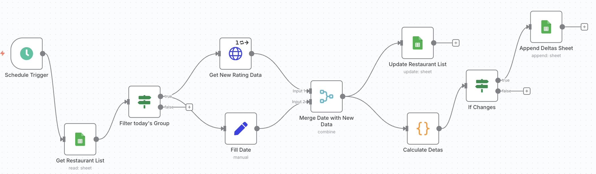
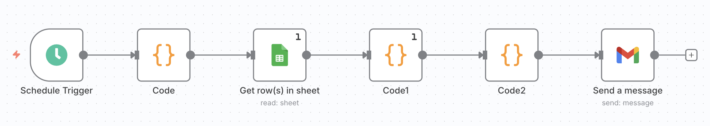

# 🍽️ ReviewPulse – Automated Restaurant Ratings & Reviews Monitor  

End-to-end automation built with **n8n**, **Google Sheets**, and **OpenAI**, designed to track restaurant reputation changes at scale.  

---

## ✨ What it does  
- 🔄 **Daily updates** (~1,300 restaurants, split into 5 groups to save API calls)  
- 📝 **Change logging** → Only rating/review changes are appended to a “Deltas” sheet  
- 📩 **Digest reports** → Every 5 days, changes are summarized into a report and emailed automatically  
- 🤖 **AI summary (optional)** → Generate highlights like “Top movers” or “Biggest shifts”  

---

## 🚀 Workflow Architecture  

### 1. **Daily Workflow**  
- ⏰ Triggered by schedule (runs every day)  
- 🗂️ Reads full restaurant list and splits into groups (~260/day)  
- 🔍 Pulls fresh ratings & reviews (Google Places API)  
- 📊 Merges with existing data → calculates deltas  
- ✅ If something changed → appends to **Deltas sheet**  

---

### 2. **Digest Workflow** (every 5 days)  
- ⏰ Triggered every 5th day  
- 📥 Reads all entries from **Deltas sheet** for the last 5 days  
- 📊 Summarizes key changes (biggest rating shifts, most new reviews)  
- 🤖 (Optional) Sends the summary through **OpenAI** for a polished report  
- 📧 Delivers via Gmail  

---

## 🛠️ Tech Stack  
- **n8n (self-hosted)** → Orchestration, scheduling, error handling  
- **Google Sheets** → Source of truth & append-only change log  
- **Google Places API** → Fetches ratings and reviews  
- **OpenAI (optional)** → Creates natural-language digests  
- **Gmail/SMTP** → Sends automated reports  

---

## 📊 Data Model  

**Restaurants (master list)**  
row_number | name | address | place_id | rating | userRatingCount | last_checked | run_today | group

**Deltas (append-only log)**  
date | place_id | row_number | name | rating | userRatingCount | delta_rating | delta_reviews | changed

---

## ⚡ Challenges & Learnings  

### 🔒 API Quotas & Limits  
- **Problem:** Google Places API has strict daily request limits. With ~1,300 restaurants, calling all at once would burn through quota.  
- **Solution:** Split the dataset into **5 rotating groups** (~260/day) → only one group updates per run, keeping calls within limits.  

### 🔀 Change Detection  
- **Problem:** Pulling ratings daily would quickly fill sheets with duplicate data.  
- **Solution:** Implemented a **delta calculation step** → only new or changed values (ratings/reviews) are logged.  

### 📊 Data Merge Logic  
- **Problem:** Combining new API results with the existing dataset while keeping row order and metadata consistent.  
- **Solution:** Built a **merge-and-calculate step** in n8n → ensures updated ratings/reviews are written in place, while old data persists.  

### ⏱️ Digest Scheduling  
- **Problem:** If emails were sent daily, they would become noise and lose value.  
- **Solution:** Introduced a **5-day batching workflow** → aggregates all deltas before sending a digest, creating a useful “newsletter-style” report.  

### 🧩 Workflow Structure  
- **Problem:** A single massive workflow was harder to debug and maintain.  
- **Solution:** Split into **two modular workflows**:  
  - **Daily updater** (lightweight, API-focused)  
  - **5-day reporter** (summarization + email)  

### 🛠️ Key Takeaways  
- Respect API limits from day one  
- Always log only the deltas  
- Modular automation = easier debugging + better scalability  
- AI summaries add polish, but the core automation works even without them  

---

## 🚧 Next Steps / Improvements  
- Add **visual dashboards** (Tableau/Looker Studio) to track long-term trends  
- Integrate **alerts** (e.g., Slack/Telegram) for major rating drops  
- Expand beyond restaurants → cafes, bars, or other local businesses  
- Add **multi-city support** with a single consolidated pipeline  

---

## 💡 Why this project?  
I’m passionate about food 🍜, but I also wanted to build something that shows **automation + data engineering skills**:  
- ✅ Automates real-world data collection  
- 📈 Tracks changes without manual effort  
- 🗞️ Produces clean, shareable digests  
- 🔧 Shows modular workflow design and problem-solving 