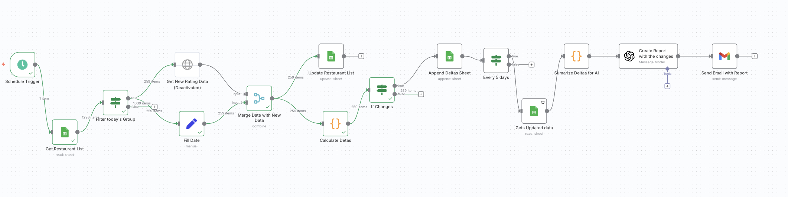

# 🍽️ ReviewPulse – Automated Restaurant Ratings/Reviews Monitor  

End-to-end workflow built with **n8n**, **Google Sheets**, and **OpenAI**.  

I’m a foodie, and I wanted something original that actually keeps me updated on the restaurant scene I care about. Ratings and reviews change daily, and it’s impossible to track manually. So I built this automation to:  

- 🔄 Refresh ratings & reviews daily (~1,300 restaurants, rotated in groups to save API calls)  
- 📝 Log only the **real changes** (into a “Deltas” sheet)  
- 📩 Send a **5-day digest** with highlights (top movers, biggest changes)  
- ⚡ Stay flexible: the list can always be updated via Google Places API  

---

## 🚀 Workflow Overview  
 

---

## ⚙️ How it works  

### Daily  
- ⏰ Schedule trigger starts the run  
- 🗂️ Restaurants split into 5 groups (~260 each)  
- 📊 Only one group updated per day (saves API requests)  
- 🔍 New data pulled from **Google Places API**  
- ✅ Deltas calculated & logged (only if something changed)  

### Every 5 days  
- 📥 Aggregate deltas  
- 🤖 Optional AI summary (OpenAI)  
- 📧 Email digest delivered  

---

## 🛠️ Tech Stack  
- **n8n (self-hosted)** → Orchestration, scheduling, retries  
- **Google Sheets** → Source of truth + change log  
- **Google Places API** → Ratings & reviews  
- **OpenAI (optional)** → AI summaries  
- **Gmail / SMTP** → Send reports  

---

## 📊 Data Model  

**Venues (input & updates)** 
row_number | name | address | place_id | rating | userRatingCount | last_checked | run_today | Group

**Deltas (append-only log)**  
date | place_id | row_number | name | rating | userRatingCount | delta_rating | delta_reviews | changed

---

## 💡 Why this project  

Aside from being a foodie 🍜, I wanted:  
- ✅ A fresh, reliable restaurant list  
- 📈 Trend tracking without manual work  
- 🗞️ Crisp digests I can share with recruiters or stakeholders  
- 🧠 A project that shows automation & data engineering skills  

---

